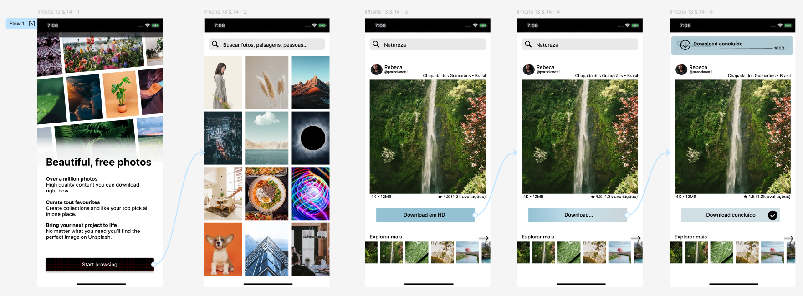

# UX — Case Study

## Sobre o projeto
Projeto conceitual de UX focado em melhorar a experiência de download de imagens em aplicativos mobile.

## Problema
Usuários não possuem confirmação clara após realizar o download de uma imagem, gerando dúvidas e repetição de ações.
- Dúvidas
- Repetição de ações
- Insegurança na navegação

## Hipótese
Se o sistema fornecer feedback visual imediato e persistente, o usuário terá maior sensação de controle e reduzirá a repetição de ações.

## Solução
Criação de feedback visual imediato:
- Notificação de download concluído
- Mudança de estado do botão
- Confirmação visual permanente

## Resultado esperado
- Redução de incerteza e frustração
- Aumento da percepção de controle do usuário
- Melhoria da fluidez da navegação
- Diminuição da carga cognitiva

## Conceitos aplicados
- Feedback do sistema
- Usabilidade
- Clareza de ação
- Redução de carga cognitiva

---
## Implementação e Protótipo

### Telas Desenvolvidas

### Processo completo
Acesse o planejamento e construção do fluxo:
[Ver planejamento e construção do fluxo](https://www.figma.com/design/m37MBa4kNDrsk3uddiKeKS/Teste?node-id=0-1&p=f&t=StI42sjWarFAqv5c-0)

### Protótipo navegável
Seguir o passo a passo abaixo para interagir:
[Interagir com o protótipo](https://www.figma.com/proto/m37MBa4kNDrsk3uddiKeKS/Teste?node-id=1-3&p=f&t=tedsj85LnGz3Bfu3-0&scaling=scale-down&content-scaling=fixed&page-id=0%3A1&starting-point-node-id=1%3A3)

### Como navegar no protótipo
1. Clique em **Start Browsing** para iniciar o fluxo.
2. Selecione uma imagem.
3. Clique em **Download** duas vezes para simular a ação.
4. Observe a mudança de estado do botão e a confirmação visual persistente.

---

## Decisões de Design
### Feedback persistente
Optei por manter a confirmação visível após o download para reduzir incerteza e evitar repetição de ações.

### Mudança de estado do botão
O botão altera visualmente após a ação para indicar que o download foi concluído, reforçando o princípio de feedback do sistema.

### Confirmação imediata
A resposta ocorre no mesmo contexto da ação, evitando redirecionamentos e reduzindo carga cognitiva.

---

## Autora
Gabriella Daniele Damião  
Estudante de Ciência da Computação | Interesse em Produto e UX

